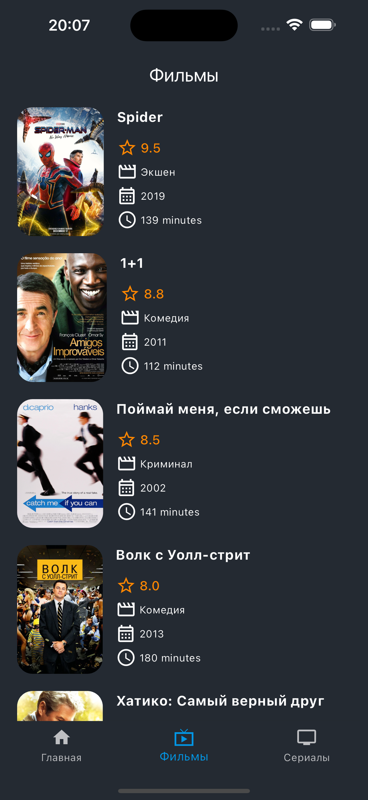

# 🎦 Filmoteka (В РАЗРАБОТКЕ)

<b>Filmoteka</b> - это приложение для управления и организации коллекции фильмов. Оно предоставляет пользователю возможность создавать и хранить список фильмов, отмечать просмотренные фильмы, добавлять отзывы и оценки, а также находить новые фильмы для просмотра.

## 😄 Auth
    - Login: admin@admin
    - Password: admin

## 🦉 Stack
    - Sdk: '>=3.3.4 <4.0.0'
    - Supabase_flutter: ^2.5.4 
    - Flutter_secure_storage: ^9.2.2
    

#  🍿 В планах:

Вот некоторые основные функции и возможности, которые могут быть реализованы в приложении Filmoteka:

1. Регистрация и аутентификация пользователей: Пользователи могут создавать учетные записи и входить в систему для сохранения своей персональной коллекции фильмов.

2. Добавление фильмов: Пользователи могут добавлять новые фильмы в свою коллекцию, указывая информацию о названии, годе выпуска, жанре, режиссере и других деталях.

3. Просмотр списка фильмов: Пользователи могут просматривать свою коллекцию фильмов в удобном списке, отсортированном по различным критериям, таким как название, год выпуска или жанр.

4. Отметка просмотренных фильмов: Пользователи могут отмечать фильмы как просмотренные, чтобы легко отслеживать, какие фильмы они уже посмотрели.

5. Добавление отзывов и оценок: Пользователи могут добавлять отзывы и оценки для каждого фильма в своей коллекции. Это позволяет им делиться своими впечатлениями о фильмах и помогает им запомнить, что они думали о каждом фильме.

6. Поиск новых фильмов: Приложение может предоставлять возможность поиска новых фильмов на основе различных критериев, таких как жанр, режиссер, актеры или рейтинг. Это помогает пользователям находить интересные фильмы для просмотра.

7. Рекомендации фильмов: Приложение может использовать алгоритмы рекомендаций для предлагания пользователям новых фильмов на основе их предпочтений и истории просмотров.

8. Интеграция с внешними сервисами: Приложение может интегрироваться с внешними сервисами, для получения дополнительной информации о фильмах, такой как рейтинги, обзоры и трейлеры.

Это лишь некоторые из возможностей, которые можно реализовать в приложении Filmoteka. Фактический функционал приложения может быть расширен или изменен в зависимости от потребностей пользователей и разработчиков.

